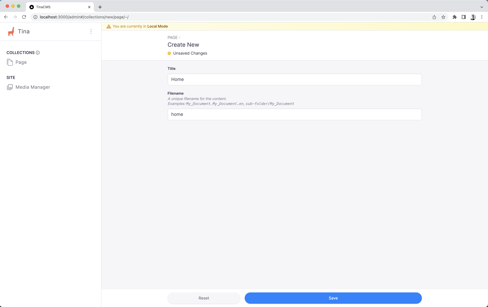

# Adding Tina

TinaCMS will enable us to use Markdown files for our content, we'll then use that content to replace the hardcoded content we have in our components.

```
npm install tinacms @tinacms/cli
```

## Add the `tina` folder

The `tina/config.ts` file is where you configure Tina. Here, you'll define the schema for your content, as well as instructions
for how to source media, and where Tina should bundle it's output to.

```
mkdir tina
```

Next, lets add the config file:

```
touch tina/config.ts
```

We'll also add a `.gitignore`. Tina bundles some files during builds which we don't want to include in Git history

```
touch tina/.gitignore
```

Add `__generated__` to the `tina/.gitignore`:

```
__generated__
```

In the `tina/config.ts` file, we'll define our config:

```ts
import { defineConfig } from "tinacms"

export default defineConfig({
  build: {
    publicFolder: "public",
    outputFolder: "admin",
  },
  schema: {
    collections: [
      {
        label: "Page",
        name: "page",
        format: "md",
        path: "content/pages",
        fields: [{ name: "title", label: "Title", type: "string" }],
      },
    ],
  },
  // These values will be used by Tina Cloud when we're ready to deploy to our host
  branch: "",
  clientId: "",
  token: "",
})
```

You can read more about the `tina/config.ts` [here](https://tina.io/docs/reference/config/), but for now, it's important to note
that we've defined a `page` collection. This will be used by the homepage.

## Running the Tina dev server

Tina works on your local machine by spinning up a dev server, this server does not replace your framework's dev server, they're both used while you work locally. With that in mind, we can run both servers at the same time by
passing a sub-command to Tina's dev command. We'll replace the `dev` script in our `package.json`:

```json
"scripts": {
  "dev": "tinacms dev -c \"next dev\"",
```

Now let's run it:

```
npm run dev
```

You'll notice some additional output from Tina in your terminal:

```sh
Starting Tina Dev Server
Indexing local files ⠋
│
○  Tina Dev Server is running... ──────────────────────────────────────────╮
│                                                                          │
│  🦙 Tina Config                                                          │
│     CMS:                <your-dev-server-url>/admin/index.html           │
│     API playground:     <your-dev-server-url>/admin/index.html#/graphql  │
│     API url:            http://localhost:4001/graphql                    │
│                                                                          │
│  🤖 Auto-generated files                                                 │
│     GraphQL Client:     tina/__generated__/client.ts                     │
│     Typescript Types:   tina/__generated__/types.ts                      │
│                                                                          │
│                                                                          │
├──────────────────────────────────────────────────────────────────────────╯
Starting subprocess: next dev
- ready started server on 0.0.0.0:3000, url: http://localhost:3000
```

As you can see here, Tina exports a bundle into the "public" directory of your framwork. Since we specified `/admin` as the `build.outputFolder` in our Tina config and our NextJS process is running on port `3000`, Tina can be seen by visiting `http://localhost:3000/admin/index.html`


### Cleaning up the URL

It'd be nice if we could just visit `http://localhost:3000/admin`, but out of the box, NextJS doesn't serve `.html` files at their base paths. To fix this, we'll update the `next.config.js`:

```diff
// next.config.js
/** @type {import('next').NextConfig} */
const nextConfig = {
  reactStrictMode: true,
  experimental: {
    appDir: true,
  },
+  async rewrites() {
+    return [
+      {
+        source: "/admin",
+        destination: "/admin/index.html",
+      },
+    ]
+  },
}

export default nextConfig
```

Head to `http://localhost:3000/admin` to confirm

## Adding the `home` page

Let's use Tina to build some content. You'll notice we only have the `Page` collection in the Tina dashboard, let's create a home page
to get started, it'll only have one field, since that's all that we've defined in our schema in `tina/config.ts`

Visit [http://localhost:3000/admin#/collections/new/page/~/](http://localhost:3000/admin#/collections/new/page/~/)

Let's call it `"Home"`, and use `home` as the filename:



Notice Tina added the markdown file to your filesystem at `content/pages/home.md` with the `title` field in the frontmatter:

```md
---
title: Home
---
```
